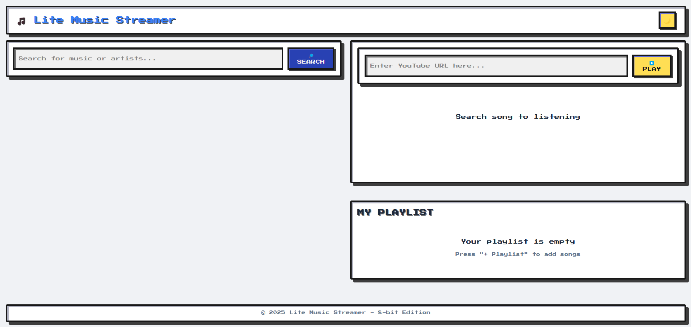

# 🎵 Lite Music Streamer

เว็บสตรีมเพลงน้ำหนักเบา ใช้งานง่าย ฟังเพลงผ่าน YouTube ได้ทันที พร้อมฟีเจอร์ค้นหาเพลง สร้าง Playlist และเล่นเพลงจากลิงก์ YouTube โดยตรง

 <!-- แนะนำให้ใส่ภาพหน้าจอของเว็บ -->

## 🚀 ฟีเจอร์หลัก

- 🔎 **ค้นหาเพลง / ศิลปิน**  
  ค้นหาด้วยชื่อเพลงหรือศิลปินผ่าน YouTube Data API

- ▶️ **เล่นเพลงจาก YouTube**  
  ฝัง YouTube Player ด้วย react-youtube พร้อมควบคุมการเล่น

- 🔗 **ใส่ลิงก์ YouTube ด้วยตนเอง**  
  รองรับการวางลิงก์ YouTube แล้วเล่นได้ทันที

- 📁 **สร้าง Playlist ส่วนตัว** _(ต้องเชื่อม Firebase)_  
  เก็บเพลงโปรดและเรียกดูย้อนหลังได้

- 🌓 **โหมดมืด / โหมดสว่าง**  
  ปรับธีมได้ด้วย DaisyUI

---

## 🛠 Tech Stack

| หมวด        | เทคโนโลยี                          |
| ----------- | ---------------------------------- |
| Frontend    | Next.js, TailwindCSS, DaisyUI      |
| YouTube API | YouTube Data API v3, react-youtube |
| State       | React Context / Zustand            |
| Auth        | NextAuth.js _(Optional)_           |
| Backend     | Firebase / Supabase _(Optional)_   |

---

## ⚙️ การติดตั้งและรันโปรเจกต์

```bash
# 1. Clone โปรเจกต์
git clone https://github.com/nnackpt/Lite-Music-Streamer.git
cd lite-music-streamer

# 2. ติดตั้ง dependencies
npm install

# 3. ตั้งค่า .env.local
cp .env.example .env.local
# แล้วกรอก API key ของ YouTube และ Firebase (ถ้าใช้)

# 4. รัน dev server
npm run dev
```
